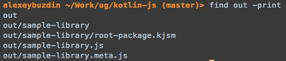
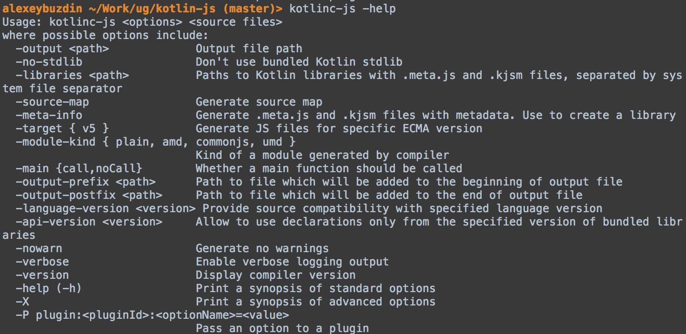
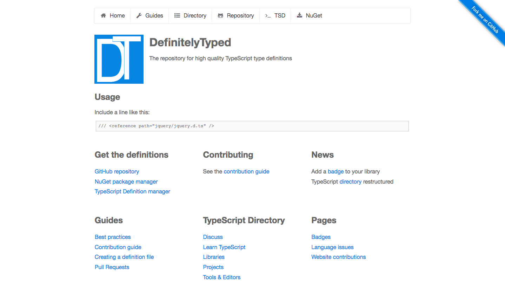

autoscale:true
build-lists: true
theme: Poster


#  _**Kotlin/js**_
### Is it a thing?
#### _**Alexey Buzdin**_, _March 2017_

---


## _**Me**_
  
### Writing _**Mobile**_ and _**Java**_ stuff
### Organizing _**events**_
### Speaking at _**conferences**_
### Teaching _**people**_

---

#  _**Kotlin**_
## Is it a thing?

---

# Great at _Android_!


---

>“She turned to the sunlight
  And shook her yellow head,
And whispered to her neighbor:
    "Winter is dead.”
##- A.A. Milne, **When We Were Very Young**


[.footer: *https://spring.io/blog/2016/02/15/developing-spring-boot-applications-with-kotlin*]

---


[.footer: *https://github.com/gradle/gradle-script-kotlin*]

—-—
#  _**Kotlin/js**_


—-—

##  Install Kotlin
### _`brew install kotlin`_

—

### **Let’s create** _**HelloKotlin.kt**_

```kotlin
fun main(args: Array<String>) {
    println("Hello JavaScript!")
}
```

—-—

### **Let’s create** _**HelloKotlin.kt**_

```kotlin
fun main(args: Array<String>) {
    println("Hello JavaScript!")
}
```
### _**Let’s compile it to**_ **javascript**

```bash 
kotlinc-js -output out/sample-library.js -meta-info HelloKotlin.kt
```

—-—

### **Let’s create** _**HelloKotlin.kt**_

```kotlin
fun main(args: Array<String>) {
    println("Hello JavaScript!")
}
```

### _**Let’s**_ **~~compile~~** _**transpile it to**_ **javascript**

```bash 
kotlinc-js -output out/sample-library.js -meta-info HelloKotlin.kt
```

—-—

# Generated content

## *.meta.js - metainformation for reflection
——-

``` javascript
if (typeof kotlin === 'undefined') {
  throw new Error(“Error loading module …”);
}
this['sample-library'] = function (_, Kotlin) {
  'use strict';
  var println = Kotlin.kotlin.io.println_s8jyv4$;
  function main(args) {
    println('Hello JavaScript!');
  }
  _.main_kand9s$ = main;
  Kotlin.defineModule('sample-library', _);
  main([]);
  return _;
}(typeof this['sample-library'] === 'undefined' ? {} : 
this['sample-library'], kotlin);
```

—

``` xml
<!DOCTYPE html>
<html lang="en">
<head>
  <meta charset="UTF-8">
  <title>Console Output</title>
</head>
<body>

<script type="text/javascript" src="node_modules/kotlin/kotlin.js"></script>
<script type="text/javascript" src="out/sample-library.js"></script>
</body>
</html>
```

## The _Kotlin_ Standard Library is also on _**NPM**_!

—
# Help 


—
### _**Running with**_ Gradle
``` groovy

buildscript {
    ext.kotlin_version = '1.1.1'

    repositories { mavenCentral() }
    dependencies {
        classpath "org.jetbrains.kotlin:kotlin-gradle-plugin:$kotlin_version"
    }
}

apply plugin: 'kotlin2js'

repositories { mavenCentral() }

dependencies {
    compile "org.jetbrains.kotlin:kotlin-stdlib-js:$kotlin_version"
}
```

—

## All language features in _Kotlin 1.1_ works in _**JavaScript**_!

—

## All _**JS**_ libraries are available in _Kotlin_!
### _**Use [ts2kt](https://github.com/kotlin/ts2kt) to convert type definitions**_



[.footer: http://definitelytyped.org]

—

# _Thank You_!
## Q&A
### _**Follow me on Twitter**_ @AlexeyBuzdin