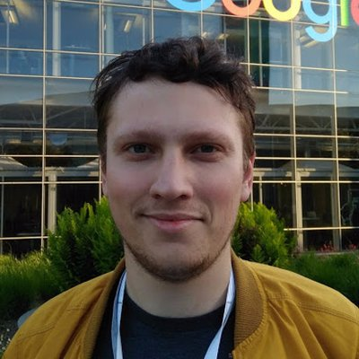
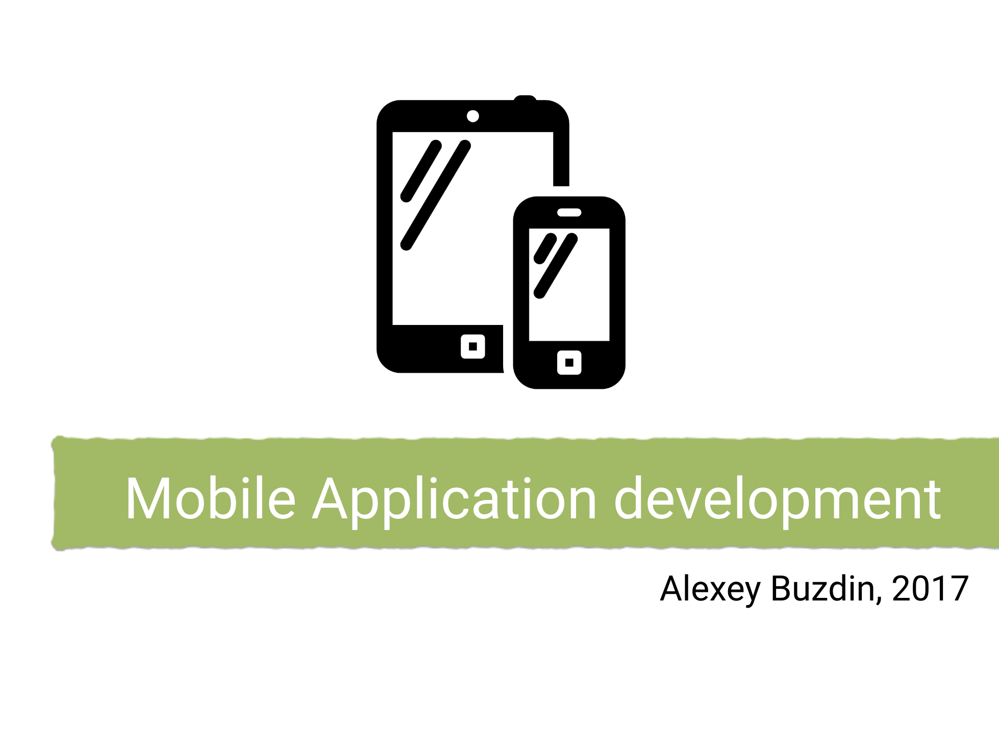
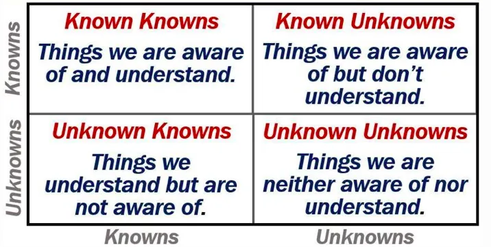
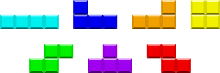

theme: Teya Branding
[.slide-transition: true]
[.text: #000000, Figtree]

# **Uni**-versal 
## Knowledge 

---
[.background-color: #FFF]
[.text: #000000, Figtree]
[.text-strong: #000000, text-scale(1.5), Figtree]

# About me:
__Alexey Buzdin__

Senior Engineering Manager 
 

 
Previously: Professor at a Uni

[.slide-transition: fadeThroughColor(#000000)]

---

## Computer 
## Science?

---
 
## Masters?

---

## Doctorate?

--- 
[.header: #fff, text-scale(1.0), Figtree]
### Fond memories...

---
### But would you 
### recommend it to 
### your **best friend**?

---

## Computer Science Bachelor's 
### [in Latvia]
Bachelor degree of engineering science in computer systems

Duration: Full-time studies - 3-4 years

---
# What is CS about?

**1. Math**

[.list: #fff, alignment(left)]

- Mathematics
- Discrete Mathematics
- Graph Theory
- Probability Theory
- Mathematical Statistics

---
# What is CS about?

**2. Computers**

[.list: #fff, alignment(left)]
- Computer Architecture 
- Computer Networks 
- Computer Graphics 
- Operating systems 
- Assembly Languages

--- 
# What is CS about?

**3. Software**

[.list: #fff, alignment(left)]
- Programming
- Object-Oriented Programming
- Data Structures and Algorithms
- Databases
- Software Engineering
- Systems Modelling

--- 
# What is CS about?

**4. Soft Skills**

[.list: #fff, alignment(left)]
- Professional English
- Labour Safety, Civil Defence and Environment Protection
- Foundations of Start up Development

---
# What is CS about?

[.list: #fff, alignment(left)]
- **1. Math**
- **2. Computers**
- **3. Software**
- **4. Soft Skills**

--- 
# Additionally

[.autoscale: true]

Numerical Methods in Computer Calculations, Programming Languages Concepts , Blockchain Technologies, Functional Programming, Declarative Programming, Web Application Construction, Application development with Java/.NET, Concepts of Machine Learning, Cybersecurity, Software Testing, Introduction to Scientific Research, Physics, Optimization Methods, Cloud Computing & Internet of Things, Embedded Electronic Devices, Quantum Computing, Data Warehouses, Methods of Computer Processing of Statistical Data, Cryptography, Graphic Design, Project Management, Internet, Netiquette and the Legal Regulation , Multithreading, Economics

---
*Notice:* Programme is only good when it is done by professors that are active in the industry.

--- 
*Notice:* Programme get stale if they are not reworked

---
### So is this CS degree good?

---
### So is this CS degree good?

## **Yes!**

---

# Thank You!
## **Questions?**

---  
**In reality:** It depends...

--- 

## How does our **brain** work

--- 

## Chunking technique

The chunking technique is a memory trick our brains use to divide large pieces of information into smaller, more digestible units.

[.list: #fff, alignment(left)]
- Group
- Finding patterns
- Organizing information by meaning

---

“…there are **known knowns**; there are things we know we know. We also know there are **known unknowns**; that is to say we know there are some things we do not know. But there are also **unknown unknowns** — the ones we don’t know we don’t know.”

– **Donald Rumsfeld**, United States Secretary of Defense

---

# Known 
# Known

---

# Known 
# Unknown

---
# Unknown 
# Unknowns

---

---

Having **more** diverse **knowledge** base, if you chunk your knowledge successfully, the **less Unknown Unknowns** is and the better you are prepared for challenges ahead.

---
[.autoscale: true]
## Junior Engineer Requirements

[.column]
*Technical Skills*

[.list: #fff, alignment(left)]

- Programming Proficiency
- Algorithms & Data Structures
- Version Control
- Problem Solving
- Debugging and Testing
- Software Development Tools
- Databases
- Software Development Life Cycle
- Basic Knowledge of Web Development

[.column]
*Soft Skills*

[.list: #fff, alignment(left)]

- Communication Skills
- Collaboration
- Adaptability
- Attention to Detail
- Time Management
- Willingness to Learn
- Receptiveness to Feedback

---

# Employers view 
Practice and feedback shows that a new Engineer with **2x years of practical experience** on average gets up to speed **faster** then a Bachelor after **4x years of study**

---
[.autoscale: true]
## Software Engineer Requirements

[.column]
*Technical Skills*

[.list: #fff, alignment(left)]

- Advanced Programming Skills
- System Design
- Algorithms & Data Structures
- Databases
- Cloud Services & Infrastructure
- Version Control
- Testing and Automation
- Code Review and Mentorship
- Continuous Integration/Continuous Deployment (CI/CD)

[.column]
*Problem Solving*

[.list: #fff, alignment(left)]

- Complex Problem Solving
- Troubleshooting and Debugging
- Project and Time Management
- Task Estimation and Prioritization
- Stakeholder Communication
- Effective Communication
- Decision-Making
- Collaboration and Leadership

[.column]
*More Problem Solving*

[.list: #fff, alignment(left)]
- Team Collaboration
- Mentorship
- Ownership and Accountability
- Continuous Learning and Adaptability
- Keeping Up with Industry Trends
- Openness to New Challenges

---

## FAANG approach for hiring

 
 
 
 
 
Bachelor's degree or equivalent practical experience 3-5 years 

---
[.autoscale: true]
## Senior Software Engineer

---
Your **Career** depends on **you playing Tetris** with your **knowledge**

---
## Is University just
###  for **learning the material?**

---
# ECTS 
### European Credit Transfer and Accumulation System
60 ECTS per year

1500–1800 hours per year

1/2 to 3/4 of the time is self-study

---

## Community & Connections

---

# Programming Clubs
- Datoriki
- 8-bit Panda
- Developer Student Club

---
- Hackathons
- Google Summer of Code
- Erasmus+

---  

**In reality:** It depends...

--- 
**In reality:** It depends...

You need to broaden You horizon to grow, which tools you will use for this is up to you.

---
LinkedIn Alexey Buzdin
Twitter @AlexeyBuzdin
Talk https://github.com/AlexeyBuzdin/talks

# That's all folks!
